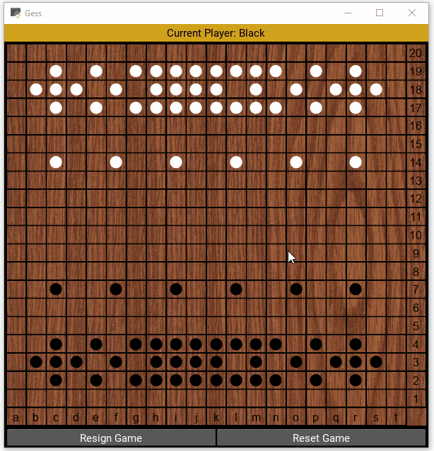

# Gess Strategy Game

This is a python-based implementation of the abstract strategy board game of [Gess](https://www.chessvariants.com/crossover.dir/gess.html): a Chess/Go hybrid. 

## Getting Started

To run the application, simply download, install Python, and run.

### Prerequisites

Python 3.7.5 is required to run this application.

## Built With

* [Kivy](https://kivy.org/#home)

## License

This project is licensed under the MIT License - see the [LICENSE.md](LICENSE.md) file for details

## Acknowledgments

* Various reference material from [GeeksforGeeks](https://www.geeksforgeeks.org/) and [StackOverflow](https://stackoverflow.com/),as well as [Mozilla's color picker tool](https://developer.mozilla.org/en-US/docs/Web/CSS/CSS_Colors/Color_picker_tool).
* Much appreciation goes to the details of the well-written [Kivy framework docs](https://kivy.org/doc/stable/api-kivy.html).
